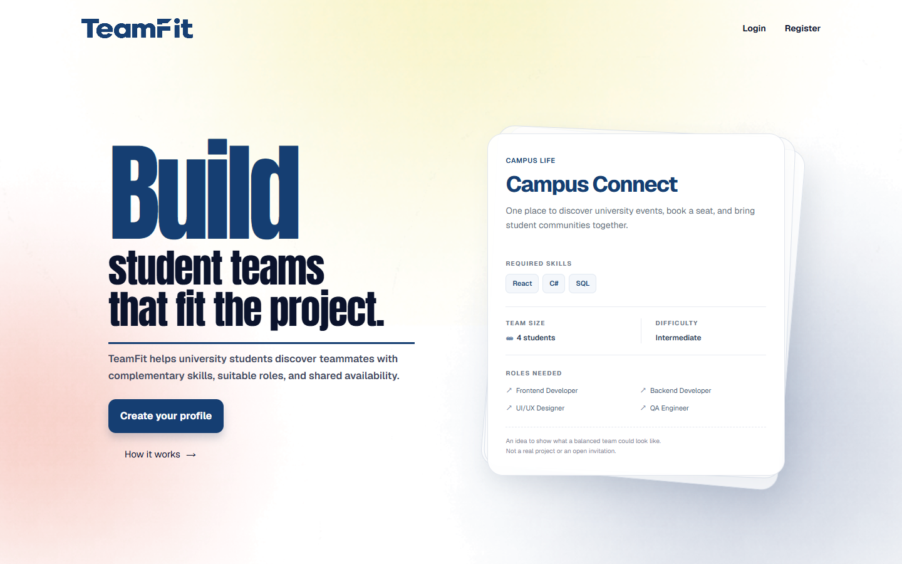
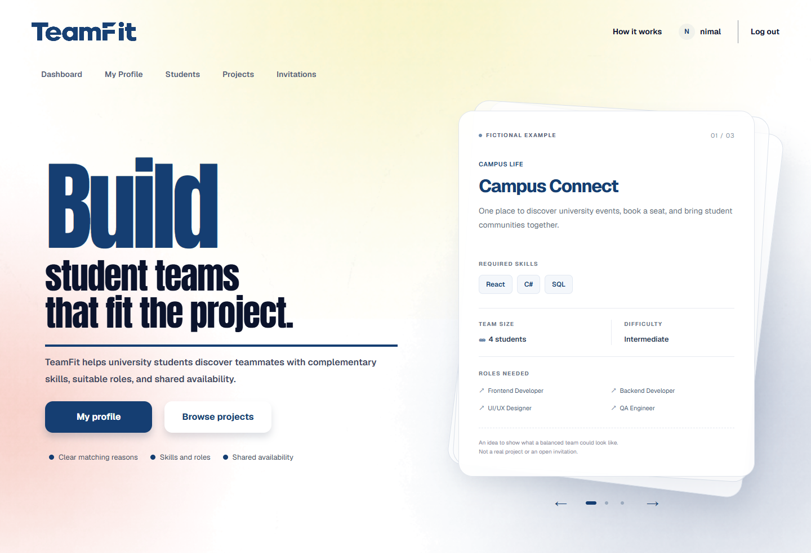
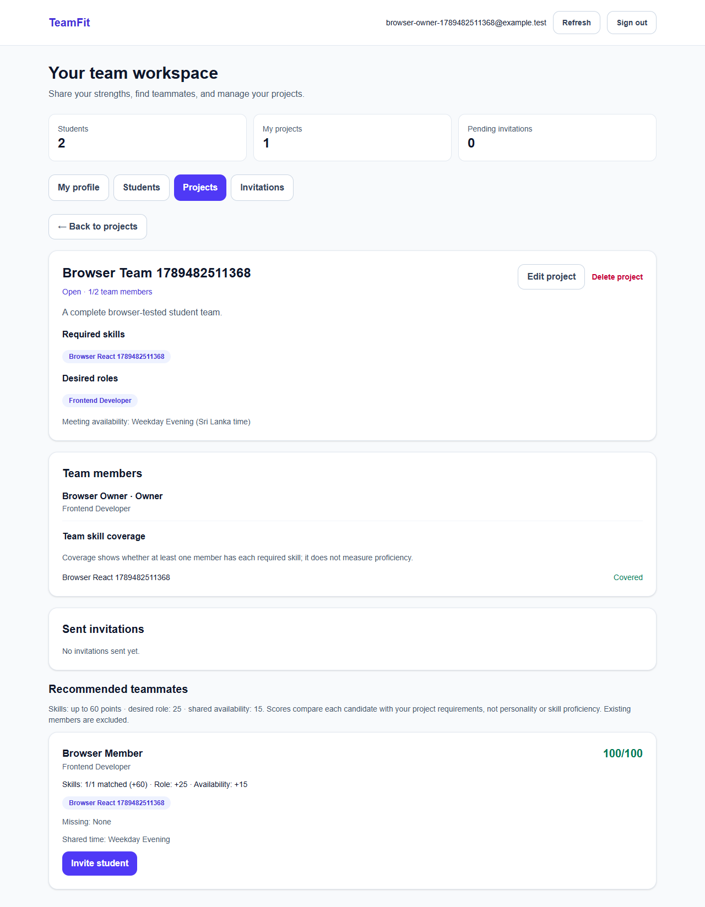
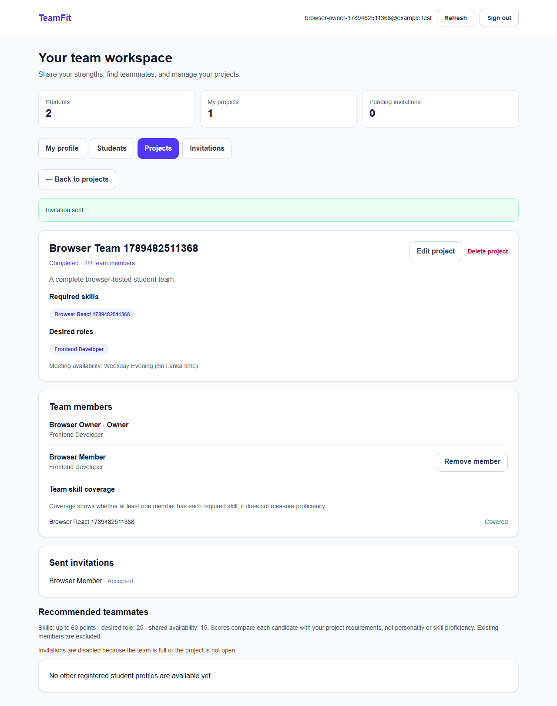

# TeamFit

A student project-team formation platform built with **Next.js, ASP.NET Core, and SQL Server**. Students create profiles, describe project requirements, compare explainable recommendations, and form teams through invitations.

This is a working individual full-stack learning project, not an AI/ML matching service. Start at **/**: guests see the public landing page; signed-in students with profiles see their display name, My profile, and Browse projects. Both homepages use a compact viewport-fit layout and link to How It Works below the hero buttons. Registration requires profile setup before opening workspace pages. Normal login opens the dashboard, while protected deep links keep their destination after profile setup. Workspace pages use dashboard cards and page-specific links instead of a shared navigation bar. The TeamFit logo always opens the landing page. **/workspace** redirects to the dashboard for existing bookmarks.

## Features

- Register, sign in, persistent sessions, and sign out with token revocation.
- Create, update, and delete your own student profile.
- Upload or replace a profile picture by clicking the circle on My Profile (JPG/PNG, up to 2 MB). Photos are stored in SQL Server; removing a photo restores the name's first letter. The dashboard avatar also displays the saved photo.
- Predefined, categorized skill catalog with searchable multi-select for profile and project forms.
- Search/filter students by name, skill, role, and availability.
- Create, edit, and delete projects; manage Open / InProgress / Completed status.
- Ranked recommendations with matched skills, missing skills, and score explanations.
- Send, cancel, reject, and accept invitations; invitation inbox with a pending counter.
- Project owners automatically join their team; members can leave; owners can remove members.
- Capacity checks protected against concurrent invitation acceptance.
- Team skill-coverage summary and dashboard counts.
- Separate owned/joined project pages, profile onboarding, and shareable project URLs.
- Owners create, assign, edit, and delete tasks; assignees update their own task status.
- Saved task progress; leaving/removing a member unassigns their tasks without deleting the work.
- Server-side validation, ownership authorization, error messages, and responsive screens.
- Reference-based branding, separate guest/member landing controls, fictional example project cards, and a dedicated How It Works page.
- Temporary display usernames derived from the first word of a saved profile name; account emails are not shown in the header.

## Screenshots

These screenshots use synthetic test accounts, not real student information.




The following workflow screenshots are from the earlier workspace styling:




## Architecture

```text
Browser
  Next.js / React / TypeScript / Tailwind
       |
       | REST requests + HttpOnly session cookie
       v
  ASP.NET Core controllers
       |-- DTOs: request validation and response shape
       |-- Services: matching rules and JWT creation
       |-- Ownership checks: signed-in account, project owner, invite recipient
       v
  EF Core DbContext + migrations
       v
  SQL Server
```

The browser never connects directly to SQL Server. Database entities are mapped to response DTOs instead of exposing EF navigation graphs.

```text
TeamFit/
  frontend/
    src/app/             Home, auth pages, and protected (workspace) routes
    src/components/      Forms, directory, projects, invitations
    src/lib/             API client and TypeScript types
    tests/               Playwright browser workflow
  backend/
    Controllers/         REST endpoints and access checks
    DTOs/                Validated request and response contracts
    Models/              Database entities
    Data/                EF Core context and relationships
    Services/            Matching and token creation
    Migrations/          Versioned SQL schema changes
  tests/
    MatchingChecks/      Pure scoring regression checks
    api.test.mjs         Real SQL Server/API integration checks
  scripts/               Local setup and isolated test runner
  docs/                  Setup, delivery, deployment and screenshots
```

## Requirements

- Windows with SQL Server default instance **MSSQLSERVER** running.
- Windows account permitted to create the local development database.
- .NET 8 SDK (a newer SDK capable of targeting .NET 8 also works).
- Node.js 22 and npm.
- Git. SSMS is useful for viewing data; it does not need to remain open.
- Chrome and `sqlcmd` for the optional full integration/browser test suite.

Versions are recorded in `frontend/package-lock.json`, `backend/backend.csproj`, and the local EF tool manifest. No Postman installation is required.

## First-time setup

Open PowerShell in the **TeamFit root folder**, with both development servers stopped:

```powershell
powershell -NoProfile -ExecutionPolicy Bypass -File scripts/setup.ps1
```

The script restores packages, generates a random JWT signing key **only when one does not exist**, stores it using .NET user-secrets, applies EF migrations, and creates `.env.local` only if it is missing. It never deletes your database. The execution-policy option applies only to this process; it does not change the machine policy.

The local development connection is in `backend/appsettings.Development.json`:

```text
Server=localhost;Database=TeamFitDb;Trusted_Connection=True;TrustServerCertificate=True
```

`TrustServerCertificate=True` is for your local SQL Server certificate only. Do not copy that setting blindly to a public deployment.

To do setup manually, see [the step-by-step run guide](docs/run-guide-si.md).

## Run the project

**Terminal 1 — from TeamFit:**

```powershell
cd backend
dotnet run --launch-profile http
```

**Terminal 2 — from TeamFit:**

```powershell
cd frontend
npm run dev
```

Open [TeamFit](http://localhost:3000). Swagger is available at [localhost:5273/swagger](http://localhost:5273/swagger). Use `localhost` consistently, not a mixture of `localhost` and `127.0.0.1`.

Keep both terminals running. Use **Ctrl+C** to stop them. Do not start a second copy on the same port.

## First real workflow

1. Register an account with an email not already attached to a legacy profile.
2. Create your profile; choose a role, skills, and meeting availability.
3. In another browser profile/incognito window, register a second student and create their profile.
4. As the first student, create a project with required skills, desired roles, and meeting times.
5. Open the project; inspect the recommendation scores and invite the second student.
6. As the second student, use **Pending invitations → Accept** on the dashboard after profile setup. The logo opens the landing page.
7. Refresh the owner's workspace; the team now includes both students.
8. On the project details page, create a task and assign it to the second student.
9. The second student opens **Dashboard → My projects → Joined projects → View project** and updates their task to **Done**.
10. Task progress updates from saved tasks. The owner changes the overall project status separately.

Different tabs in the **same browser profile share the same login cookie**. Use separate browser profiles/incognito sessions when demonstrating multiple users.

Pre-authentication student records are preserved with a nullable account link. They remain visible as legacy profiles but cannot be edited or invited. Registration intentionally does **not** claim an existing profile just by matching its email.

## Matching formula

```text
skill points = 60 × matched required skills / total required skills
role points = 25 if the preferred role is desired, otherwise 0
availability points = 15 if at least one meeting period overlaps, otherwise 0
total = skill points + role points + availability points
```

Example: 3 of 4 required skills, a desired role, and shared availability = **45 + 25 + 15 = 85/100**.

Scores use distinct required skills and are rounded to two decimals. Ties use matched-skill count, student name, then student ID. Existing members and legacy profiles are excluded from candidates. A score is a rule-based fit estimate, not a prediction of performance. Availability periods use Sri Lanka local time.

## API overview

Except for options, registration, and login, endpoints require authentication.

| Area | Endpoints |
| --- | --- |
| Authentication | POST /api/auth/register, /login, /logout; GET /api/auth/me |
| Options | GET /api/options |
| Students | GET/POST /api/students; GET /api/students/me; GET/PUT/DELETE /api/students/{id} |
| Profile skills | GET/POST /api/students/{id}/skills; DELETE /api/students/{id}/skills/{skillId} |
| Profile picture | GET/PUT/DELETE /api/students/{id}/photo (PUT uses multipart field `file`; only the owner can upload or remove) |
| Skill catalog | GET /api/skills; GET /api/skills/{id} (custom skill creation is disabled) |
| Projects | GET/POST /api/projects; GET/PUT/DELETE /api/projects/{id} |
| Matching | GET /api/projects/{id}/recommendations |
| Teams | GET /api/projects/{id}/members; DELETE /api/projects/{id}/members/{studentId} |
| Tasks | GET/POST /api/projects/{id}/tasks; PUT/DELETE /api/projects/{id}/tasks/{taskId}; PATCH /api/projects/{id}/tasks/{taskId}/status |
| Owner invitations | GET/POST /api/projects/{id}/invitations |
| Inbox | GET /api/invitations; PUT /api/invitations/{id}; DELETE /api/invitations/{id} |

`GET /api/projects?mine=true` returns owned and joined teams. Student list supports `search`, `role`, `skillId`, and `availability` query parameters.

Project responses include isMember, taskCount, completedTaskCount, and progressPercent. Task contents are visible only to the owner/current members. A task may be unassigned or assigned to one current member. Progress is the rounded percentage of tasks with status **Done** (zero when no tasks exist); it is not a measure of effort or overall software quality. Task updates do not automatically change the project's Open / InProgress / Completed status.

Swagger: register/login, copy the response token, click **Authorize**, and paste the token without adding another `Bearer` prefix. Do not commit real tokens in `.http` files.

## Security decisions

- Passwords use ASP.NET Core's salted password hasher; no plaintext passwords are stored.
- Signed JWTs validate issuer, audience, signature, lifetime, and account token version.
- Browser sessions use **HttpOnly, SameSite=Strict** cookies; production cookies are Secure.
- JWTs are not stored in localStorage. API clients can use bearer tokens.
- Cookie-authenticated write requests check their Origin.
- CORS permits only the configured frontend origin; registration/login are limited to 10 attempts per IP per minute.
- Logout revokes all existing tokens for the account.
- Ownership rules are enforced on the server, not just by hiding UI buttons.
- Database uniqueness and transactions enforce important constraints.
- Secrets and test traces are ignored by Git; public `NEXT_PUBLIC_*` values must never contain secrets.

There is no email ownership verification, forgotten-password email service, administrator console, or university SSO in this release. Do not describe registration as verified NSBM membership. These need separately designed requirements before use as an official university service.

## Verification

From the TeamFit root:

```powershell
dotnet run --project tests/MatchingChecks --configuration Release
powershell -NoProfile -ExecutionPolicy Bypass -File scripts/test.ps1
```

For the complete Chrome workflow, stop existing servers on 5273/3000, then:

```powershell
powershell -NoProfile -ExecutionPolicy Bypass -File scripts/test.ps1 -Browser
```

The test script creates a randomly named **TeamFitTest_...** database, starts the actual API, runs tests, and removes only that disposable database in cleanup. It does not use TeamFitDb. Browser mode also builds/starts Next.js. Logs remain in the displayed temporary test folder; screenshots/traces are under `frontend/test-results` and ignored by Git. Never publish traces containing real sessions.

Additional checks:

```powershell
cd frontend
npm run lint
npm run build
npm audit
```

Landing UI regression tests use intercepted API responses and do not touch SQL Server. With the frontend running:

```powershell
cd frontend
npx playwright test tests/landing.spec.ts
```

Set TEAMFIT_UI_URL to a different local frontend URL to test a separate preview without stopping the normal servers. These UI tests are not a substitute for the real API/SQL workflow suite.

GitHub Actions runs frontend lint/build/audit, backend build, and matching checks. SQL Server and browser tests are a separate local suite, not falsely reported as part of CI.

## Deployment and delivery

The application can run locally end-to-end. **A public deployment has not been created.** See [deployment requirements](docs/deployment.md) for environment settings, HTTPS/cookie considerations, database migration, and the choices needed to publish it.

See [the landing UI guide](docs/landing-ui-update-si.md) for the latest branding, guest/member views, and display-name behavior. The [structure upgrade guide](docs/structure-upgrade-si.md) explains the workspace routes and task permissions; its earlier homepage description is superseded by the landing UI guide.
