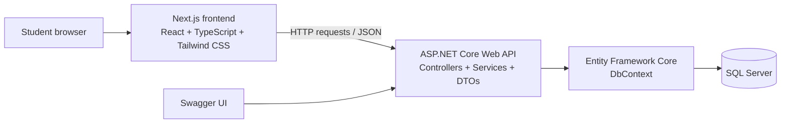

# TeamFit MVP and Architecture Plan

## 1. Project purpose

TeamFit helps university students form more suitable project or assignment teams. It uses each student's skills, preferred role, and availability to recommend people who fit a project request.

The goal of the first version is to demonstrate a complete full-stack workflow without introducing unnecessary complexity.

## 2. MVP definition

The MVP (Minimum Viable Product) is the smallest useful version of TeamFit that can be demonstrated locally.

### MVP user flow

1. A user creates a student profile.
2. The user adds skills, a preferred project role, and available time slots.
3. The user creates a project request with required skills, desired roles, and suitable meeting times.
4. TeamFit returns a ranked list of recommended students.
5. The user can see the score and the reasons for each recommendation.

### MVP features

- Create, view, edit, and delete student profiles.
- Add reusable skills to student profiles.
- Select one preferred project role.
- Select one or more availability slots.
- Browse and filter students by skill and role.
- Create a project request.
- Add required skills, desired roles, and preferred availability to a project request.
- View student recommendations for a project request.
- Display an understandable score breakdown for every recommendation.

### MVP success criteria

The MVP is complete when a local user can add several sample students, create a project request, and receive a ranked recommendation list through the web application.

## 3. Intentionally out of scope

The following features are useful but will be built only after the MVP works:

- Registration and login.
- JWT authentication and authorization.
- Real team invitations and accept/reject actions.
- Notifications or email messages.
- Admin tools.
- AI or machine-learning matching.
- Automatic formation of complete teams.
- Deployment.

Authentication is deliberately delayed. It is easier to learn and test profile CRUD and API communication first. A real invitation feature also needs authentication so that TeamFit knows who sent and received an invitation.

## 4. Architecture



### Responsibilities

| Part | Responsibility |
| --- | --- |
| Next.js frontend | Shows pages and forms, sends requests to the API, and displays returned data. |
| ASP.NET Core API | Validates requests, performs business rules, calculates matches, and returns JSON. |
| EF Core | Converts C# data operations into database queries. |
| SQL Server | Permanently stores the application data. |
| Swagger | Lets us test API endpoints in the browser before connecting the frontend. |

## 5. Backend structure

The API will begin as one beginner-friendly project. We will not introduce a complicated multi-project architecture yet.

```text
TeamFit.API/
├── Controllers/     # HTTP endpoints such as /api/students
├── Data/            # DbContext and database configuration
├── DTOs/            # Request and response shapes used by the API
├── Models/          # Database entities such as Student and Skill
├── Services/        # Business rules, including matching calculations
├── Program.cs       # Application startup and configuration
└── appsettings.json # Settings such as the database connection string
```

### Key terms

- **Controller:** Receives a web request and returns an HTTP response.
- **Model (entity):** A C# class that represents data stored in the database.
- **DTO:** A Data Transfer Object. It defines the exact data that enters or leaves the API.
- **Service:** A class that holds business logic. The matching algorithm belongs here, not in a controller.
- **DbContext:** EF Core's connection between C# entity classes and database tables.

## 6. Initial data design

The following tables will be created gradually during the database stages.

| Data item | Purpose |
| --- | --- |
| Student | Stores a student's name, university email, bio, and preferred role. |
| Skill | Stores reusable skills such as React, C#, SQL, and UI Design. |
| StudentSkill | Connects a student with multiple skills. |
| StudentAvailability | Stores a student's selected availability slots. |
| ProjectRequest | Stores the project title, description, and intended team size. |
| ProjectRequiredSkill | Connects a project request with its required skills. |
| ProjectAvailability | Stores appropriate meeting times for a project request. |

`StudentSkill` is a join table. It is needed because one student can have many skills and one skill can belong to many students.

For the MVP, roles and availability will use controlled options. This keeps data consistent and makes matching and filtering dependable.

Suggested roles:

- Frontend Developer
- Backend Developer
- UI/UX Designer
- Database Developer
- QA Tester
- Project Manager

Suggested availability slots:

- Weekday Morning
- Weekday Afternoon
- Weekday Evening
- Weekend Morning
- Weekend Afternoon
- Weekend Evening

## 7. Matching algorithm version 1

The first matching algorithm will be transparent and rule-based. It will not use AI or machine learning.

Each recommended student receives a score out of 100:

| Rule | Maximum points | Explanation |
| --- | ---: | --- |
| Required skill matches | 60 | More matching project skills gives a higher score. |
| Preferred role match | 25 | The student's preferred role is one of the roles desired for the project. |
| Availability overlap | 15 | The student and project share at least one available time slot. |

Example: a project needs React, UI Design, Git, and SQL. A student with React, UI Design, and Git matches 3 out of 4 skills, so the student receives 45 out of 60 skill points. If the role and availability also match, the final score is 85 out of 100.

The recommendation response should explain its score, for example:

```text
Score: 85/100
Matched skills: React, UI Design, Git
Role match: Frontend Developer
Shared availability: Weekday Evening
```

This version recommends individual candidates. A later version can evaluate the combined skills of a selected team and recommend members who fill missing skills.

## 8. Development order

1. Create the Git repository structure and frontend application.
2. Build a small static frontend interface to learn React and Next.js.
3. Create the ASP.NET Core Web API and test it using Swagger.
4. Configure SQL Server and Entity Framework Core.
5. Build student profile CRUD endpoints.
6. Build skill and availability features.
7. Connect the frontend to the API.
8. Build project request CRUD.
9. Implement and display matching recommendations.
10. Add authentication, invitations, validation, testing, documentation, and deployment in later milestones.

## 9. Git commit approach

One commit should represent one meaningful, working change. Examples of future commit messages:

```text
docs: define TeamFit MVP and architecture
chore: create Next.js frontend application
feat(web): add static student directory page
chore(api): create ASP.NET Core Web API project
feat(api): add student profile CRUD endpoints
feat(api): add rule-based student matching
feat(web): display project recommendations
```

This creates a readable GitHub history that shows how the application was built over time.
